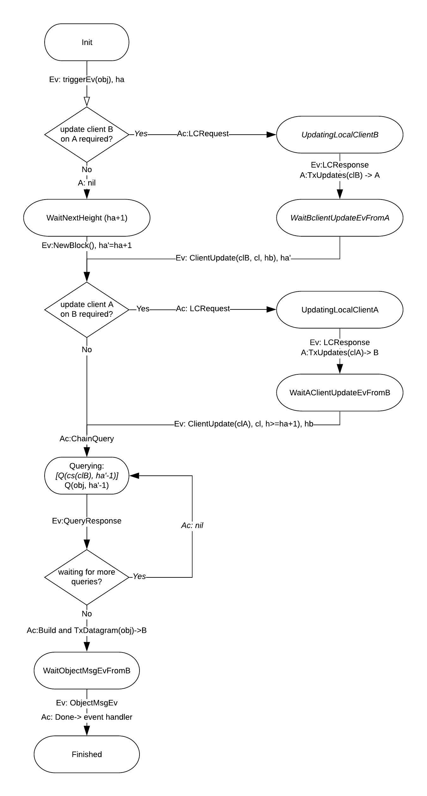

# ADR 002: IBC Relayer in Rust

## Changelog
* {date}: {changelog}

## Definitions
These definitions are specific for this document and they may not be consistent with the IBC Specification.

IBC transaction - a transaction that includes IBC datagrams (including packets). This is constructed by the relayer and sent over the physical network to a chain according to the chain rules. For example, for tendermint chains a `broadcast_tx_commit` request is sent to a tendermint RPC server.

IBC datagram - is an element of the transaction payload sent by the relayer; it includes client, connection, channel and IBC packet data. Multiple IBC datagrams may be included in an IBC transaction. 

IBC packet - a particular type of IBC datagram that includes the application packet and its commitment proof.

On-chain IBC Client (or IBC Client) - client code running on chain, typically only the light client verification related functionality.

Relayer Light Client - full light client functionality, including connecting to at least one provider (full node), storing and verifying headers, etc.

Source chain - the chain from which the relayer reads data to fill an IBC datagram.

Destination chain - the chain where the relayer submits transactions that include the IBC datagram.

A and B chains - for connection protocol, A is the "initiating" chain where `MsgConnectionOpenInit` is initially processed and eventually `MsgConnectionOpenAck`. B is the chain where `MsgConnectionOpenTry` and `MsgConnectionOpenConfirm` are processed. 
Similar for channel handshake protocol.

## Context
A relayer is an off-chain process responsible for relaying IBC datagrams between two or more chains by scanning their states and submitting transactions. This is because in the IBC architecture, modules are not directly sending messages to each other over networking infrastructure, but instead they create and store the data to be retrieved and used by a relayer to build the IBC datagrams. 

This document provides an initial Rust implementation specification of a relayer that interconnects Cosmos-SDK/ Tendermint chains.

The diagram below shows a high level view of the relayer and its interactions with the source and destination chains. The next sections go in more details of the different interactions.

.

## Assumptions and Dependencies
This section covers assumptions and dependencies about the chains and their IBC implementation. The first implementation focuses on and will only be tested with Cosmos-SDK/ Tendermint chains. In addition, functionality required by the relayer that is outside the scope of this document, and the availability of their implementations is considered.

#### Data Availability
The relayer monitors the chain state to determine when packet forwarding is required. The relayer must be able to retrieve the data within some time bound. This is referred to as **data availability**.

#### Data Legibility
IBC protocol defines the minimal data set that must be made available to relayers for correct operation of the protocol. The relayer expects the data to be legible, i.e. **data should be serialized** according to the IBC specification format; this includes consensus state, client, connection, channel, and packet information, and any auxiliary state structure necessary to construct proofs of inclusion or exclusion of particular key/value pairs in state. 
 - [IBC Specification] some protobuf specifications can be found under individual ICS-es, for exmple [ICS-03 connection protobufs](https://github.com/cosmos/ics/blob/master/spec/ics-002-client-semantics/data-structures.proto)
 Note: Some relayer development is blocked on SDK and Tendermint migration to protobuf encoding. Current work is done in [migration to protobuf](https://github.com/cosmos/cosmos-sdk/pull/6097)

#### Query Functionality 
IBC host state machines MUST expose an interface for inspecting their state. For Cosmos/Tendermint chains this means:
- the IBC modules on chain correctly implement and respond to queries
  - [IBC-Modules-Rust] an implementation for some queries currently exist in Cosmos-SDK and same and more need to be implemented in Rust. The full requirements are detailed in section Relayer Queries. 
- the relayer needs the ability to send rpc/http ABCI queries to and receive replies from Tendermint/Cosmos-SDK
  - [[ABCI Rust](https://github.com/tendermint/rust-abci)] - ABCI Rust implementation
  - [IBC-Modules-Rust] identifier validation is required (ICS-024)
  - [IBC-Modules-Rust] requires Rust types for all query responses
  - [[Merkle-Proofs-Rust](https://github.com/confio/ics23/tree/master/rust)] (candidate implementation) - some query responses include proofs and included in IBC transactions by the relayer (some may be validated, TBD)

#### IBC Messages
The relayer creates transactions that include IBC messages to manage clients, connections and channels, and send application packets to destination chains. These messages must be defined in the IBC Rust implementation [IBC-Modules-Rust].

#### IBC Logging System
IBC packet data & timeouts are not stored directly in the chain state (as this storage is presumed to be expensive) but are instead committed to with a succinct cryptographic commitment (only the commitment is stored).
As a consequence, IBC requires that a **host state machine MUST provide an event logging system** that logs data in the course of transaction execution. **Logs must be queryable** by relayers to read IBC packet data & timeouts. 

The logging system must provide the following functions:
 - [IBC-Modules-Go] emitLogEntry for emitting log entries called by the state machine during transaction execution:
   - type emitLogEntry = (topic: string , data: []byte) => void
   - example: emitLogEntry("sendPacket", {sequence: packet.sequence , data: packet.data, timeout: packet.timeout})
 - [IBC-Modules-Go] queryByTopic for querying past logs matching a given topic:
   - type queryByTopic = (height: uint64 , topic: string) => Array < []byte >

#### Keyring 
The relay process must have access to its accounts with tokens on all destination chains, with sufficient balance to pay for transaction fees. Account key information must be stored and managed securely. A keyring implementation is required for CRUD key operations. 
[Keyring-Rust] Investigation in existing Rust implementations is needed. (ex: [hwchen-keyring](https://github.com/hwchen/keyring-rs))

### Chain Transactions and Signing
The relayer must create chain specific signed transactions. 
[Cosmos-Tx-Rust] For the first release Cosmos-SDK transaction signing is required. One possible implementation is [iqlusion's sdtx crate](https://github.com/iqlusioninc/crates/tree/develop/stdtx)

#### Implementation of IBC "routing module"
The default IBC handler uses a receiver call pattern, where modules must individually call the IBC handler in order to bind to
ports, start handshakes, accept handshakes, send and receive packets, etc. While this provides flexibility for modules, it imposes extra work on the part of the relayer processes that now needs to track the state of multiple modules. The IBC specification describes an IBC “routing module” to route packets, and simplify the task of relayers. This routing module accepts external datagrams and calls into the IBC handler to deal with handshakes and packet relay. The routing module keeps a lookup table of modules, which it can use to look up and call a module when a packet is received, so that external relayers need only ever relay packets to the routing module.
[IBC-Routing-Module-Go] Initial version of the relayer assumes that chains implement the "routing module"

#### Batching
The relayer may batch IBC datagrams in a single transaction if supported by destination chain and allowed by configuration. In this case the relayer can  amortise any overhead costs (e.g. signature checks for fee payment).
Initial version of the relayer assumes batching is supported by all chains. An option may be later included in the configuration file.

## Relayer Requirements

A correct relayer MUST:

- **[R-config-start]** Read, parse, validate a configuration file upon start and configure itself for the specifed chains and paths
- **[R-transport]** Have access to the networking protocols (e.g. TCP/IP, UDP/IP, or QUIC/IP) and physical transport, required to read the state of one blockchain/ machine and submit data to another
- **[R-provider]** Maintain transport connections to at least one full node per chain
- **[R-query]** Query IBC data on source and destination chains
- **[R-light-client]** Run light clients for source chains and 
- **[R-IBC-client]** create and update IBC clients on destination chains 
- **[R-accounts]** Own accounts on destination chains with sufficient balance to pay for transaction fees
- **[R-transact]** Create, sign and forward IBC datagram transactions
- **[R-relay]** Perform correct relaying of all required messages, according to the IBC sub-protocol constraints
- **[R-restart]** Resume correct functionality after restarts
- **[R-upgrade]** Resume correct functionality after upgrades
- **[R-proofs]** Perform proof verification (as it will be done on the destination chain) and not forward messages where proof verification fails

The relayer MAY:
- **[R-config-cli]** Provide ways to change configuration at runtime
- **[R-bisection]** Perform bisection to optimize transaction costs and computation on destination chains
- **[R-relay-prio]** Filter or order transactions based on some criteria (e.g. in accordance with the fee payment model)

## Implementation
The initial implementation will heavily borrow from the Go relayer implementation that uses a "naive" algorithm for relaying messages. The structure of the configuration file is similar with the one in Go (see [Go-Relayer](https://github.com/cosmos/relayer))

### Configuration
(WIP)
Upon start the relayer reads a configuration file that includes global and per chain parameters. The file format is .toml
Below is an example of a configuration file.

```toml
title = "IBC Relayer Config Example"

[global]
timeout = "10s"
strategy = "naive"

[[chains]]
  id = "chain_A"
  rpc_addr = "localhost:26657"
  account_prefix = "cosmos"
  key_name = "testkey"
  store_prefix = "ibc"
  client_ids = ["clA1", "clA2"]
  gas = 200000
  gas_adjustement = 1.3
  gas_price = "0.025stake"
  trusting_period = "336h"

[[chains]]
  id = "chain_B"
  rpc_addr = "localhost:26557"
  account_prefix = "cosmos"
  key_name = "testkey"
  store_prefix = "ibc"
  client_ids = ["clB1"]
  gas = 200000
  gas_adjustement = 1.3
  gas_price = "0.025stake"
  trusting_period = "336h"

[[connections]]

[connections.src]
  client_id = "clB1"
  connection_id = "connAtoB"

[connections.dest]
  client_id = "clA1"
  connection_id = "connBtoA"

[[connections.paths]]
  src_port = "portA1"
  dest_port = "portB1"
  direction = "unidirectional"

[[connections.paths]]
  src_port = "portA2"
  dest_port = "portB2"
  direction = "bidirectional"

[[connections.paths]]
  src_port = "portA3"
  dest_port = "portB3"
  src_channel = "chan3-on-A"
  dest_channel = "chan3-on-B"
```
The main sections of the configuration file are:
- `global`:
Relaying is done periodically and the frequency is dictated by the `timeout` parameter. The `strategy` parameter configures the relayer to run a particular relaying algorithm.
- `chains`:
Chain level information including account and key name, gas information, trusting period, etc. All source and destination chains must be listed here.
- paths (`connections`, `connections.paths`): 
The relayer may be configured to relay between some application ports, over a number of connections and channels, in unidirectional or bidirectional mode.

### Initialization

The relayer performs initialization based on the content of the configuration file:
- the file is parsed and semantically validated
- the chains, connections, ports, channels for which relaying is enabled are stored in the Config structure

```rust
pub struct Config {
    pub global: GlobalConfig,
    pub chains: Vec<ChainConfig>,
    pub connections: Option<Vec<Connection>>, 
}

pub enum Strategy {
    Naive,
}

pub struct GlobalConfig {
    pub timeout: Duration,
    pub strategy: Strategy,
}

pub struct ChainConfig {
    pub id: ChainId,
    pub rpc_addr: net::Address,
    pub account_prefix: String,
    pub key_name: String,
    pub client_ids: Vec<String>,
    pub gas: u64,
    pub trusting_period: Duration,
}

pub struct Connection {
    pub src: Option<ConnectionEnd>,    // use any source
    pub dest: Option<ConnectionEnd>,   // use any destination
    pub paths: Option<Vec<RelayPath>>, // use any port, direction bidirectional
}

pub struct ConnectionEnd {
    pub client_id: String,
    pub connection_id: Option<String>, // use all connections to this client
}

pub enum Direction {
    Unidirectional,
    Bidirectional,
}

pub struct RelayPath {
    pub src_port: Option<String>,  // default from any source port
    pub dest_port: Option<String>, // default from any dest port
    pub src_channel: Option<String>,  // default from any source port
    pub dest_channel: Option<String>, // default from any dest port
    pub direction: Direction, // default bidirectional
}
```
All `Option` fields with `None` values mean "any" values. For `direction`, default is bidirectional.
All non-`Option` fields are mandatory and must appear in the configuration file.
If the relayer is started with an invalid configuration file, an error is displayed and the realyer process exits.

### Relayer Commands

#### Validate
To validate a configuration file:

`relayer -c <config_file> config validate ` 

The command verifies that the specified configuration file parses and it is semantically correct. 

#### Light Client Initialization
To initialize a light client:

`relayer -c <config_file> light init -x <hash> -h <height> <chain>`

The command initializes the light client for `<chain>` with a trusted height and hash. This should be done for all chains for which relaying is performed.

#### Start
To start the relayer:

`relayer -c <config_file> start` 

The command performs the validation as described above and then starts the relayer.

#### Query
Most of the queries performed while relaying are also available from the CLI. For example:

`relayer -c <config_file> query client state <chain> <client_id> [-h <chain_height>] [-p <proof_required>]`

The command queries the full client state of `<client_id>` on `<chain>` at `<height>`, with or without proof depending on the `<proof_required>` flag. Default `<height>` is latest state and `<proof_required>` is `true`. 

`relayer -c <config_file> query client consensus <chain> <client_id> <consensus_height> [-h <chain_height>] [-p <proof_required>]`

The command queries the consensus state of `<client_id>` at height `<consensus_height>` on `<chain>` at `<height>`, with or without proof depending on the `<proof_required>` flag. Default `<height>` is latest state and `<proof_required>` is `true`.

Other CLIs are available but not described here. 

### Relayer Queries
The relayer queries chain state in order to build the IBC messages. It is expected that each chain type provides implementations of these queries. Initial Rust relayer implementation will be tested with Cosmos-SDK/Tendermint chains, and while some of the IBC-Modules functionality in Rust is not required (e.g. handler functions), a "query" crate should be available for the relayer. 
For tendermint, the queries use the `abci.RequestQuery` over rpc/http to retrieve the data. 

The format of the public/ provable state query parameters and responses is chain independent and should also be defined in this crate.
 
The following queries are required:

- `query_store_prefix(chain)` - returns the commitment prefix of the chain (returns chain specific []byte, e.g. `ibc` for tendermint)
- `query_all_client_states(chain)` - returns the IBC light clients instantiated on the chain
- `query_client_consensus_state(chain, clientID, height)` - returns the consensus state proof for a light client at a given height if height > 0, else it returns the latest height
- `query_connections(chain)` - returns all connections created on the chain
- `query_client_connections(chain, clientID)` - returns all connections associated with a light client
- ...more to be added

### Relayer Concurrency Architecture
The following threads, shown in figure below, are spawned and execute within the relayer process:


`config executor` - single thread that runs upon start and 
 - triggers initiation messages for objects included in the config file. These are disjoint from the chain IBC events, something like `ConnOpenStart` or `ChannOpenStart` that could potentially cause the relayer to build and send `ConnOpenInit` or `ChannOpenInit` messages to the chain. 
 - performs a poll of all connections, channels and packets as required by its configuration file. It then sends IBC Events as required by the states of the objects queried.
    
    This initial bootstrap should work even if these events are received by the `event handler` in the same time with the live chain IBC events. In other words, no synchronization with other threads should be required.

`chain monitor` - one thread per chain that registers with the chain and forwards the notification messages to the `event handler`. Currently the relayer registers for `Tx` and `Block` notifications. It then extracts the IBC events from the `Tx` and generates a "NewBlock" event also for the block. Note that a single notification may include multiple IBC Events. Also they arrive before the `NewBlock` event.

`chain querier` - these should be short lived threads that block on ABCI queries and send the response back to event handler. Or maybe this is per chain thread in first release? Event relayer should not block on full channel to this thread.

`chain light client` - one thread per chain that receives relayer requests, downloads and verifies headers, and returns the minimal header set in the response. In addition this thread should ensure latest locally stored state does not expire, i.e. when some timer fires it fetches and verifies the latest header. Timeout should be a fraction of the trusting period. Timer should be reset by the on-demand relayer requests. 

`chain tx` - per chain thread that submits IBC messages and packets to the chain. Some sort of confirmation is expected but we need still to clarify if and how the relayer will act on this, or waits for an IBC event for confirmation, or times out.

`relayer thread` - one global thread that includes the:

- `event handler` that:
   - deconstructs the IBC event vector from the monitor and sends individual events to the `message builder`
   - receives responses from queriers and light clients, and forwards them to the `message builder`
   - receives requests from the `message builder` and forwards them to the appropriate querier , light client or tx threads
- `message builder` - runs within the same context of the event handler. There is one per builder object, i.e. instances of connections, channels and packets. It implements an FSM that triggers new queries as required, deals with "conflicting" events caused by race conditions. 
    
    Note: the CPU load is minimum and will probably be fine even when we add the (succinct) proof verification later. The IO performed by the `event handler` is also minimal as it involves only inter-thread communication...again if no blocking channels. Otherwise we revise.


### Relayer Algorithm

A relayer algorithm is described in [relayer algorithm described in IBC Specifigication](https://github.com/cosmos/ics/blame/master/spec/ics-018-relayer-algorithms/README.md#L47) and [Go relayer implementation ](https://github.com/cosmos/relayer/blob/f3a302df9e6e0c28883f5480199d3190821bcc06/relayer/strategies.go#L49.).

This section describes some of the details of the realy thread algorithm in the Rust implementation. Inputs are the IBC Events and the events of interest are described in Appendix A.

#### Proofs
The relayer must include proofs in some datagrams as required by the IBC handlers. There are two types of proofs:
- proof of some local state on source chain (A). For example, a proof of correct connection state (`ProofInit`, `ProofTry`, `ProofAck`) is included in some of the connection handshake datagrams. The `ConnOpenTry` message includes the `ProofInit` that is obtained from chain A where the connection should be in `INIT` state and have certain local and counterpary identifiers. 
- proof that the chain A's IBC client `clB` is updated with a consensus state and height that have been stored on chain B.
- these proofs are verified on chain B against the consensus state stored by the A client at `proof_height`.

Notes: 
The proof checks require the handlers on B to recreate the state as expected on chain A and to verify the proof against this. For this to work the store prefix of A needs to be added as prefix to the proof path (standardized in ICS 24). There is currently no query endpoint for this in Cosmos-SDK/Tendermint and initial relayer version includes a per chain store prefix in the configuration.
The verification on B requires the presence of a consensus state for client A at same height as `proof_height`.

#### Light Client Messages
After initialization, relayer light clients are created on the destination chains if not already present. 
For a successful A->B relay of IBC packets IBC clients must be instantiated on both source and destination chains, potentially by different relayers. The client creation is permissionless and a relayer may create a client if not already present. 
```rust
let msg = MsgCreateClient::new(client_id, header, trusting_period, bonding_period, signer);
```

The relayer runs its own light client thread for A that periodically retrieves and verifies headers. The relay thread uses the stored headers to update the A-client on chain B with new headers as required. 
```rust
let msg = MsgUpdateClient::new(client_id, header, signer);
```
It is possible that the relay thread needs a more recent trusted header and in this case it would need a mechanism to signal the client thread to retrieve this header.
Since the relayer must pay for all transactions, including `MsgClientCreate` and `MsgClientUpdate`, there are incentives for optimizations.
For example, light client implementation of Tendermint supports bisection and the relayer may choose to send skipping headers to A-client on B, periodically or when required by new IBC datagrams.

#### IBC Client Consensus State vs Relayer Light Client States vs Chain states
A number of IBC datagrams contain proofs obtained from chain A at a some height `h`. A proof needs to be verified on B against the commitment root for `h` which, for Tendermint clients, is included in the client consensus state at `h+1`. This is because for Tendermint chains the application Hash after applying all transactions in block `n` is included in block at height `n+1`. 

The relayer therefore needs to ensure that the consensus state at `proof_height+1` exists on chain B.

One proposal is shown below and described in the rest of this section.


The relayer creates a light client on B with `hi` and then updates it as required by processing different IBC events. Let `ha'` be the last consensus state for client on B.
When some IBC event for X (connection, channel or packet) is received, it includes the height, let it be `hx-1` at which the event occured on A.
According to the proposal here, the relayer should:
- get the latest consensus state height of client on B, `ha`
- let `h = max(hx, ha)`
- query for item X at height `h-1` and get a proof `p` at this height
- wait for the block at height `hx` to be received, i.e. `Ev{block, hx}`
- get the minimal set of headers from the light client such that `h` verifies against `ha` 
- send zero or more `MsgUpdateClient` datagrams and the `MsgX{X, p, h}` in a transaction to B
- if the transaction is successful or `MsgX..` failed, then "consume" the `Ev{X,..}` 
  - if `MsgX` fails there is nothing that can be done, another relayer must have submitted first
- else query again X at `hA-1` and send `MsgX{X, p, hA}`

#### Event Handler and Message Builders
These contain the main relaying logic.

##### Event Handler
Receives different event and message types from the other threads. 

```rust
pub enum RelayerEvent {
    ChainEvent(ChainEvent),
    QueryEvent(ChainQueryResponse),
    LightClientEvent(LightClientQueryResponse),
}
```

- The `ChainEvent` refers to IBC events received from the monitor threads. The raw events received from cosmos-sdk chains include a height and some fields. 
```rust
pub enum IBCEvent {
    NewBlock(NewBlock),
    CreateClient(ClientEvents::CreateClient),
    UpdateClient(ClientEvents::UpdateClient),
    //...
    OpenInitConnection(ConnectionEvents::OpenInit),
    OpenTryConnection(ConnectionEvents::OpenTry),
    //..
    OpenInitChannel(ChannelEvents::OpenInit),
    //..
    SendPacketChannel(ChannelEvents::SendPacket),
    ReceivePacketChannel(ChannelEvents::ReceivePacket),
    //..
}
```
There is some processing that needs to be done by the event handler to present an IBC Event as a `ChainEvent` that looks like this: 

```rust
pub enum BuilderEvent {
    NewBlock,
    CreateClient,
    UpdateClient,
    ConnectionOpenInit,
    ConnectionOpenTry,
    //..
}

pub struct ChainEvent {
    pub trigger_chain: ChainId,
    pub chain_height: Height,
    pub event: BuilderEvent,
    pub trigger_object: BuilderObject,
}
```
where `BuilderObject` could be a generic, trait or enum that refers to an object in an abstract way. Concretely, this can be a connection, channel or packet.

- The query events are responses from the requests sent by the relayer thread to queriers. The responses should identify the trigger request.

```rust
pub struct ChainQueryRequestParams {
    chain: ChainId,
    chain_height: Height,
    prove: bool,
    request: ChainQueryRequest,
}

pub enum ChainQueryRequest {
    ClientConsensusParams(ClientConsensusParams),
    ConnectionParams(ConnectionParams),
    //..
}

pub struct ChainQueryResponse {
    pub trigger: ChainQueryRequestParams,
    pub response: QueryResponse,
}

pub enum QueryResponse {
    ClientConsensusState(ConsensusStateResponse<ConsensusState>),
    Connection(ConnectionResponse),
    //
}
```

- The light client events are responses from the requests sent by the relayer thread to the light client thread.

```rust
pub enum LightClientRequest {
    ConsensusStateRequest(ConsensusStateRequestParams),
    //..
}

pub struct ConsensusStateRequestParams {
    chain: ChainId,
    cs_height: Height,
    last_cs_height: Height,
}

pub struct LightClientQueryResponse {
    trigger: LightClientRequest,
    response: LightClientResponse,
}

pub enum LightClientResponse {
    ConsensusStateUpdates(ConsensusStateUpdatesResponse),
}

pub struct ConsensusStateUpdatesResponse {
    headers: Vec<Header>,
}
```

The event handler maintains state information about chains, including latest chain height and heights of IBC clients hosted by those chains. This is updated by `NewBlock`, `CreateClient` and `UpdateClient` IBC events.
```rust
pub struct ChainData {
    /// Chain's height
    height: Height,
    /// Heights of clients instantiated on chain
    client_heights: HashMap<ClientId, Height>,
}
```

In addition, a collection of "message builders" is maintained. A builder is associated with a connection, channel or packet. A message builder is instantiated by an IBC event. There will be at most one builder for each unique object instance. 
A message builder has a unique key:
```rust
pub struct BuilderTrigger {
    chain: ChainId,
    obj: BuilderObject,
}
```
The event handler decides if an event needs to be processed by a given builder based on some rules. In general the event handler should not send irrelevant events to message builders. These are events for different builder object types or different object instances. For example channel events should not be sent to connection builders. And events for `connection1` should not be sent to the builder of messages for `connection2`. 
More than that, with the proposal here, the handler should only send a builder object event once and only once, at initial creation of message builder. Here is the reasoning:
The event handler decides when a message builder is created or removed based on some simple rules.
Assume `Ev:(A, event, objAtoB)` means `event` is received from chain `A` for `objAtoB`.
- if a builder doesn't exist for `(A, objAtoB)` or `(B, objBtoA)` then a builder is created and `event` is stored as part of the builder state
- if a message builder exists for `(A, objAtoB)` or `(B, objBtoA)`, and its associated event `event'` is same or higher (`>=`) than `event` then the existing builder is kept and the incoming event is discarded. Note: event order for handshake messages is: `OpenInit < OpenTry < OpenAck < OpenConfirm`
- else the existing builder is removed and a new builder is created for the "higher" event

The reasoning behind these rules is the following:
 - connections and channels - these are viewed as end-to-end from the event handler perspective. If `X` is the connection state on `A` and `Y` is the connection state on `B`, only one builder should exist associated with the end with state `max(X, Y)`. 
 TODO: Add examples, maybe in a table form.
 - packets - (to be added but similar)
 
 In summary, the event handler creates a message builder for a given builder object instance once. After this it will send the following events for processing:
 - `NewBlock`, `CreateClient`, `UpdateClient` chain events 
 - `QueryResponse` 
 - `LightClientQueryResponse`
The event handler may remove the builder before it finishes its task.

##### Message Builder
Receives and acts on the different events received from the event handler. The proposal here is to design and codify a single FSM for all object types. An example is shown below illustrating an FSM applicable to all object types.



Shown in italics are states and queries applicable only to `ConnOpenInit` event (with eventual creation of `MsgConnOpenTry`) and `ConnOpenTry` event (with eventual creation of `MsgConnOpenAck`) that both require an optional update of `B` client on source chain `A` and a mandatory consensus state proof included in the message. All the other builders will not follow those states. 

In general the more complex logic is around determining the height of client consensus states required and ensuring the corresponding updates are installed on chain. This logic is common regardless of the message being built.

Following sections detail the event handling in different states. In general a builder for messages associated with object X should only receive relevant events since, as described above, filtering is performed by the event handler.

##### Message Builder for Connection
(WIP) - add table showing handling of events for connection builders

##### Message Builder for Channel
(WIP) - add table showing handling of events for channel builders

##### Message Builder for Packets
(WIP) - add table showing handling of events for channel builders

## Inter-relayer Coordination
Multiple relayers may run in parallel and, while it is expected that they relay over disjoint paths, it could be the case that they may submit same transactions to a chain. In this case only the first transaction succeeds while subsequent fail causing loss of fees. Ideally some coordination would be in place to avoid this but this is out of scope of this document.

## Relayer Restarts and Upgrades

## Decision

> This section explains all of the details of the proposed solution, including implementation details.
It should also describe affects / corollary items that may need to be changed as a part of this.
If the proposed change will be large, please also indicate a way to do the change to maximize ease of review.
(e.g. the optimal split of things to do between separate PR's)

## Status

> A decision may be "proposed" if it hasn't been agreed upon yet, or "accepted" once it is agreed upon. If a later ADR changes or reverses a decision, it may be marked as "deprecated" or "superseded" with a reference to its replacement.

{Deprecated|Proposed|Accepted}

## Consequences

> This section describes the consequences, after applying the decision. All consequences should be summarized here, not just the "positive" ones.

### Positive

### Negative

### Neutral

### Appendix A
The IBC Events, input to the relay thread are described here.

```
{"create_client": {
   "client_id": <clientID>,
   "client_type": <clientType>,
  }
}

{"update_client": {
   "client_id": <clientID>,
   "client_type": <clientType>,
  }
}

{"connection_open_init": {
    "connection_id": <connectionID>, 
    "client_id": <clientID>, 
    "counterparty_connection_id": <connectionID>,
    "counterparty_client_id": <clientID>,
 }
}

{}"connection_open_try": {
    "connection_id": <connectionID>, 
    "client_id": <clientID>, 
    "counterparty_connection_id": <connectionID>,
    "counterparty_client_id": <clientID>, 
 }
}

{"connection_open_ack": {
    "connection_id": <connectionID>, 
 }
}

{"connection_open_confirm": {
    "connection_id": <connectionID>, 
 }
}

{"channel_open_init": {
    "port_id": <portID>,
    "channel_id": <channelID>,
    "counterparty_port_id": <portID>,
    "counterparty_channel_id": <channelID>,
    "connection_id": <connectionID>, 
 }
}

{"channel_open_try": {
    "port_id": <portID>,
    "channel_id": <channelID>,
    "counterparty_port_id": <portID>,
    "counterparty_channel_id": <channelID>,
    "connection_id": <connectionID>, 
 }
}

{"channel_open_ack": {
    "port_id": <portID>,
    "channel_id": <channelID>,
 }
}

{"channel_open_confirm": {
    "port_id": <portID>,
    "channel_id": <channelID>,
 }
}

{"channel_close_init": {
    "port_id": <portID>,
    "channel_id": <channelID>,
 }
}

{"channel_close_confirm": {
    "port_id": <portID>,
    "channel_id": <channelID>,
 }
}

{"send_packet": {
    "packet_data": String,
    "packet_timeout_height": String,
    "packet_timeout_timestamp": String,
    "packet_sequence": String,
    "packet_src_port": <portID>,
    "packet_src_channel": <channelID>,
    "packet_dst_port": <portID>,
    "packet_dst_channel": <channelID>,
}

{"recv_packet": {
    "packet_data": String,
    "packet_ack": String,
    "packet_timeout_height": String,
    "packet_timeout_timestamp": String,
    "packet_sequence": String,
    "packet_src_port": <portID>,
    "packet_src_channel": <channelID>,
    "packet_dst_port": <portID>,
    "packet_dst_channel": <channelID>,
}
```

## References

> Are there any relevant PR comments, issues that led up to this, or articles referrenced for why we made the given design choice? If so link them here!

* {reference link}
